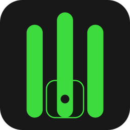
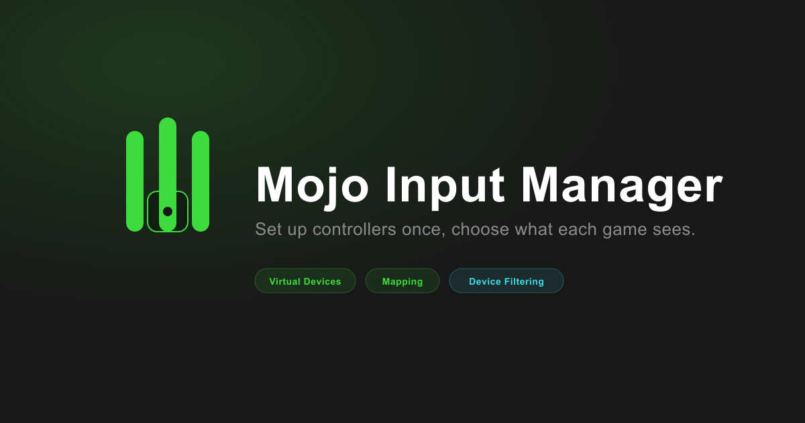

<div align="center">



# Mojo Input Manager

**Set up your controllers once, then choose exactly which ones each game sees**

[](https://github.com/mojouto3/mojo-input-manager/actions/workflows/ci.yml)
[](https://github.com/mojouto3/mojo-input-manager/releases/latest)
[](https://github.com/mojouto3/mojo-input-manager/releases)
[](https://electronjs.org)
[](LICENSE)
[](https://github.com/mojouto3)

[Features](#features) · [Installation](#installation) · [Usage](#usage) · [Building from Source](#building-from-source)

---



</div>

---

## What is Mojo Input Manager?

Sim racing and flight sim players often end up juggling several USB devices (HOTAS, HOSAS, pedals, shifters, tablets) and three separate, unrelated tools just to make them behave: one to create virtual controllers, one to remap physical inputs onto them, and one to control which game sees which device.

Mojo Input Manager (MIM) unifies all three into a single app:

- **vJoy virtual devices**: create and remove virtual controllers with a couple of clicks, no manual driver configuration
- **Mapping**: detect connected physical devices and forward their live input onto a vJoy virtual device
- **Device Filtering**: use HidHide to control exactly which physical devices are visible to which applications, with save-and-apply profiles per game

Built so you set things up once, then forget about it.

---

## Features

### Virtual Devices (vJoy)
- Lists existing vJoy virtual devices and lets you create the next free one or delete any of them
- Creation/deletion is elevated automatically (UAC prompt) since it changes the driver's persistent configuration

### Mapping
- Detects connected physical controllers live via the Gamepad API, no extra drivers needed to see them
- Shows real-time axes and button state for every selected device
- Combine multiple physical devices onto a single vJoy virtual device: select more than one, and their axes/buttons are forwarded together as one combined input
- Remembers which physical device (or combination) was last mapped to which vJoy target, and restores that selection automatically the next time it sees the same devices connected, no need to click through it again
- Forwards input with a single Start Mapping toggle
- Automatically excludes vJoy's own virtual devices from the physical device list, so you can't accidentally map a device to itself

### Device Filtering (HidHide)
- Lists all gaming HID devices with their current Hidden/Visible status, with a one-click toggle
- Cloaking on/off master switch, so nothing is hidden from any app until you turn it on
- Manage the allow list of applications that can still see hidden devices while cloaking is on
- Save named profiles (a target game + which devices should be hidden) and apply them with one click: hides the right devices, allows the game, and turns cloaking on automatically

### Settings
- Switch the app's accent color between neon green and electric cyan
- See the current app version and check for updates on demand

### Runs in the background
- Minimizes to the system tray instead of closing, with an option to launch at Windows startup
- Checks for new versions automatically and updates itself in place, no manual reinstall

---

## Installation

1. Go to the [Releases](https://github.com/mojouto3/mojo-input-manager/releases) page
2. Download the latest **`Mojo Input Manager Setup X.X.X.exe`**
3. Run the installer and follow the steps

MIM automates [vJoy](https://sourceforge.net/projects/vjoystick/) and [HidHide](https://github.com/nefarius/HidHide), and if either isn't installed, a banner at the top of the window offers to download and install it for you directly from its official source, no manual download needed.

---

## Usage

### Virtual Devices
Open the tab, click **Add Device** to create the next free vJoy virtual controller, or **Delete** to remove one.

### Mapping
Plug in a controller (move a stick or press a button if it doesn't show up right away), select one or more devices to combine, pick a target vJoy device from **Forward to**, and click **Start Mapping**. Next time you launch MIM with the same devices connected, the selection and target come back on their own.

### Device Filtering
Hide the physical devices you don't want other apps to see, turn **Cloaking** on, and add any application that should still be allowed to see everything to the **Allowed Applications** list. Save a **Profile** per game to apply the right combination in one click.

### Settings
Pick your accent color and check the app's version and update status. Closing the main window minimizes MIM to the system tray rather than quitting; use the tray icon's **Quit** option to actually exit, or its **Launch at startup** checkbox to have MIM start with Windows.

---

## Building from Source

### Requirements
- [Node.js](https://nodejs.org)
- npm (included with Node.js)
- Windows

### Run in development

```bash
git clone https://github.com/mojouto3/mojo-input-manager.git
cd mojo-input-manager
npm install
npm run dev
```

### Build the installer

```bash
npm run dist
```

---

## Project Structure

```
mojo-input-manager/
├── assets/                    Icons, logos, social preview
├── src/
│   ├── main/
│   │   ├── main.js             Electron main process, window, tray, IPC, auto-updater
│   │   ├── vjoy.js              vJoyConfig.exe wrapper (create/delete, elevated)
│   │   ├── vjoyInterface.js     vJoyInterface.dll wrapper via koffi (live feed)
│   │   ├── hidhide.js           HidHideCLI.exe wrapper (devices, cloak, apps)
│   │   ├── profiles.js          Per-game device filtering profiles
│   │   └── mappingProfiles.js   Remembered physical-device-to-vJoy mappings
│   └── renderer/
│       ├── components/          Shared UI: Card, Button, Badge, Toggle, Tabs, Sidebar...
│       ├── theme.js              Accent theme (green/cyan) persistence
│       └── views/                Dashboard, VirtualDevices, Mapping, DeviceFiltering, Settings
└── package.json
```

---

## Roadmap

See the [MIM Roadmap](https://github.com/users/mojouto3/projects/7) project board and [milestones](https://github.com/mojouto3/mojo-input-manager/milestones) for what's shipped and what's next.

---

## Workflow

| Who | What |
|-----|------|
| mojouto3 | Manager: repo administration, releases, milestones |
| Constantinos-T | Developer: feature branches, commits, PRs |

Both open PRs for their own contributions; the other reviews before merge. All PRs target `main` and require 1 review.

---

## License

MIT License, free to use, modify, and share. See [LICENSE](LICENSE) for details.

---

<div align="center">

Made with 🎮 by [mojomultimedia](https://github.com/mojouto3) · [Constantinos-T](https://github.com/Constantinos-T)

</div>
